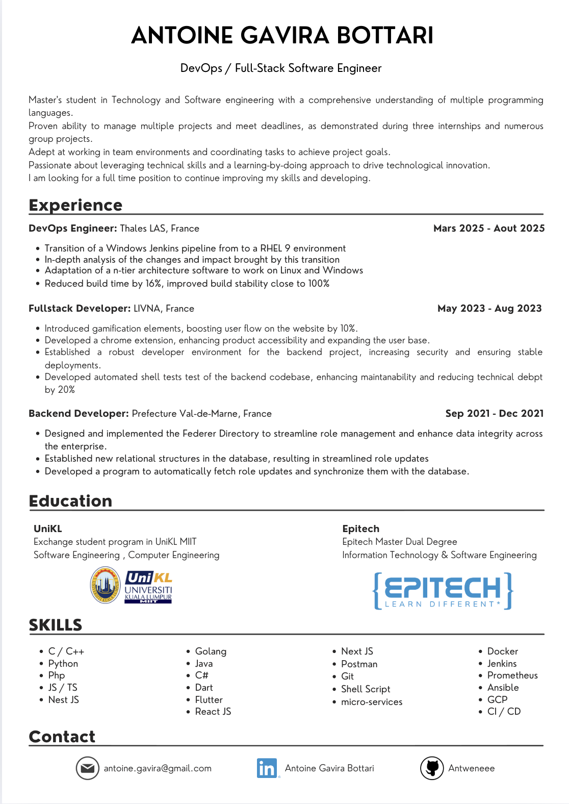

<h1 align="center">
  
</h1>
   
#    About Me:

  Hi, I'm Antoine Gavira Bottari, Devops Engineer, Fullstack Developer & Software Developer from France
   
  I speak French and English fluently
   
   
  👨‍🎓 I'm currently done with my Master's degree at EPITECH Paris in Information Technology and Software Engineering
   
  💻 I love Writing code in general, discover new technology, learning new things and challenge myself 🤓
   

<!--Languages and Tools Section-->    
#  My Lᴀɴɢᴜᴀɢᴇs ᴀɴᴅ Tᴏᴏʟs

# Some of my projects

## 💪🏼 StepForward (In progress)
<a href="https://github.com/orgs/Step-Forward-Orga/repositories">This project</a> as for goal to create a app Strava but for Gym enjoyer.   Tired of using excel sheets or notes on your phone to track your progress and organize your programs ?   
This app will replace what you use currently for planning, training plans, workouts, aimed reps and weights everything will be possible with StepForward   Available soon..  
This project use Nest js and prisma as a backend, the backend is fully dockerized, github workflow are set on the project, unit test and e2e test to come.
I also want to setup a proper Jenkins pipeline with some monitoring as well.  

## 📖 Anthologia Newspaper

<a href="https://github.com/orgs/Anthologia-Newspaper/repositories">This project</a> was an end of study project at Epitech and had for goal to make journalism uncensorable.  
By creating an app notion like, we where than able to pin the articles on IPFS making them than uncensorable because of how IPFS work.  
With a fully dockerized app, a solid nest js backend, an app hosted with GCP we managed to achieve the desired behavior.  

## 🌐 Area
<a href="https://github.com/Antweneee/Epitech/tree/main/Third-Year-Projects/DEV/Area">This project</a> was an Epitech project during my 3rd year, it was a group project with 5 peoples, in this project I was a backend developer.
  
The goal of the project was to create a web application and a mobile application that would connect multiple services such as Google, Instagram, Spotify, etc., in order to create actions and reactions like:
"If the temperature is below 20 degrees -> Tweet 'today is a cool day !'”  
We chose a multi-technology microservice architecture to diversify our skills.
I was responsible for the creating a good part of the services, the database, trigger part of the project and service handling part in Python.  

## 🗳️ Vote Gouv
<a href="https://github.com/Antweneee/Epitech/tree/main/Third-Year-Projects/DEV/Vote.gouv">This project<a/> was an Hackathon and our team committed to promoting a decentralized future, developed a mobile application to revolutionize the electoral process in France: vote.gouv.  
Built with Flutter and integrating France Connect for secure identification, our app allows citizens to browse candidates’ programs, vote anonymously, and verify results — all made possible through the use of blockchain to ensure transparency and security in elections.  
Authentication is strengthened by biometric verification and the integration of MetaMask to interact with smart contracts.
Our fully decentralized solution protects user privacy and guarantees the integrity of the electoral process.
Check out our explanatory video for a better understanding of how the application works.  

# 📋 My CV 

  

# ⚡ Stats ⚡
 

📫 How to reach me 👇

   
   